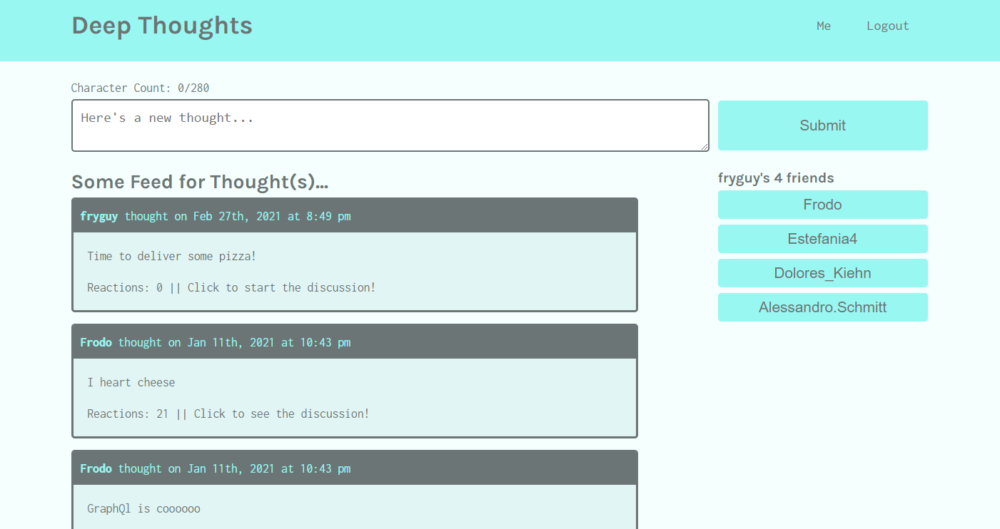
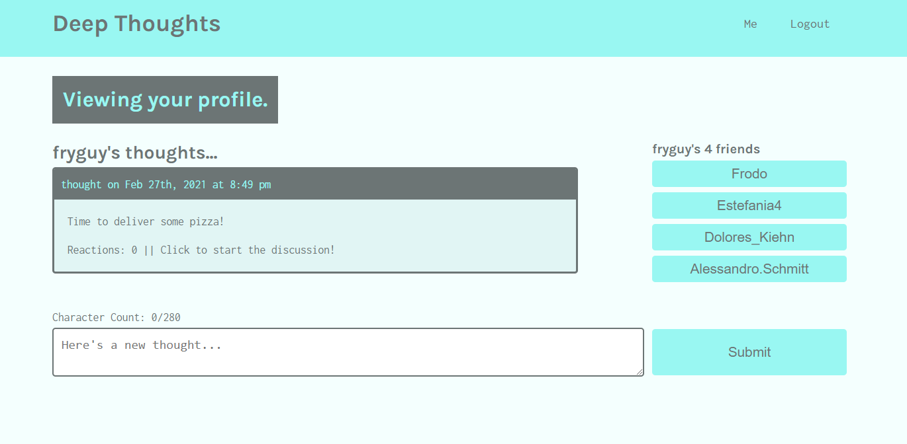
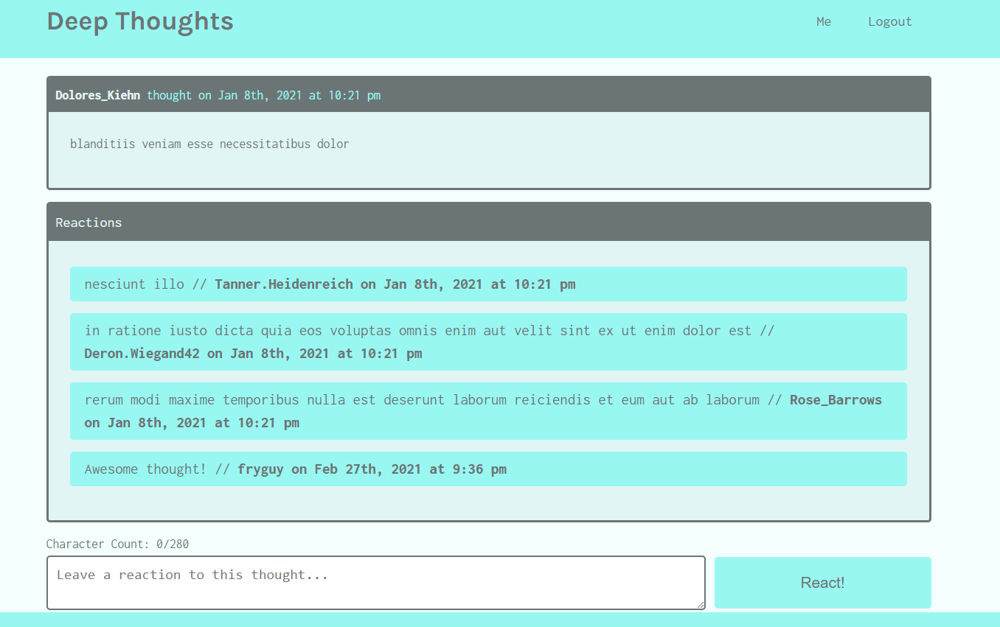

# Deep Thoughts

   

## Description
Deep Thoughts is a social media app where users can create thoughts, add reactions to other users' thoughts, and add other users to their friend list. Users can also view their own profile with their thoughts listed out, or view other users' profiles with all of their thoughts listed.

This is a full-stack MERN app using a GraphQL API and Apollo Server for interaction with the database. React was used on the front-end and MongoDB, Mongoose, Express and Node.js on the backend. GraphQL queries and mutations were used to request data and post data.

## Table of Contents
- [Technology Used](#technology-used)
- [Screenshots](#screenshots)
- [Contact](#contact)
- [Links](#links)
- [License](#license)

## Technology Used
  
  
  
  
    
   
  
  
   
  
  

## Screenshots

#### Homepage:

#### User Profile:

 #### Single Thought:
 

## Contact
Please visit my **[GitHub profile](https://github.com/tchestnut85/)** to check out this and other projects I've created and contributed to.
Contact me at **thomaschestnut00@gmail.com** with any questions or if you'd like to collaborate.

## Links
- **[Deployed App](https://deepthoughts-tc.herokuapp.com/)**
- **[GitHub Repo](https://github.com/tchestnut85/deep-thoughts)**
- **[My Portfolio](https://tomchestnut.dev)**
- **[Connect on LinkedIn](https://www.linkedin.com/in/thomas-chestnut)**

## License  
     
This app is licensed under the MIT license.
